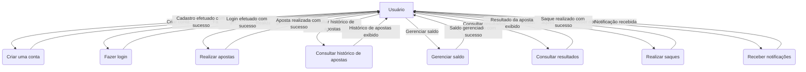

```mermaid
graph TD
    A[Usuário] -->|Criar conta| B(Criar uma conta)
    A -->|Fazer login| C(Fazer login)
    A -->|Realizar apostas| D(Realizar apostas)
    A -->|Consultar histórico de apostas| E(Consultar histórico de apostas)
    A -->|Gerenciar saldo| F(Gerenciar saldo)
    A -->|Consultar resultados| G(Consultar resultados)
    A -->|Realizar saques| H(Realizar saques)
    A -->|Receber notificações| I(Receber notificações)
    B -->|Cadastro efetuado com sucesso| A
    C -->|Login efetuado com sucesso| A
    D -->|Aposta realizada com sucesso| A
    E -->|Histórico de apostas exibido| A
    F -->|Saldo gerenciado com sucesso| A
    G -->|Resultado da aposta exibido| A
    H -->|Saque realizado com sucesso| A
    I -->|Notificação recebida| A

```
